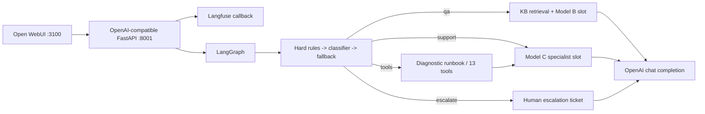

# Tuwaiq Multi-Model Technical Support Agent

Student: **Mohammed Alabdulmuhsin**

This learning project exposes a LangGraph support workflow through an OpenAI-compatible FastAPI API and Open WebUI. It includes 13 structured tool contracts, local deterministic fallbacks, three saved model artifact references, Langfuse integration, and reproducible evaluation helpers.

## Honest project status

The API and Docker stack run, but the current checkout is **not production-ready**:

- Model A's weight file is a Git LFS pointer and its `config.json` is absent, so runtime routing uses a deterministic fallback.
- Model B and Model C artifacts exist, but their inference runners are not connected to the graph; deterministic QA/support runners are used.
- No pre-fine-tuning baseline was recorded, so none of the three model quality gates can be claimed as passed.
- The latest local Golden Set run passed 1 of 10 required cases.
- The supplied deployment URL, <https://aitss.xor01.com/>, returned HTTP 404 when checked on 2026-09-20.
- Langfuse credentials were rejected by both the default/EU and US cloud hosts, so no valid trace URL or screenshot is claimed.

See [the evaluation report](docs/TRAINING_EVALUATION_REPORT.md) for measurements and limitations.

## Architecture



The implemented policy is safety rules first, the fine-tuned classifier when it is loadable, and a deterministic fallback when it is not. `hybrid_router.py` also supports an LLM router for ambiguous cases, but no live small-LLM invoker is configured in this checkout.

## Run with Docker Compose

Prerequisites: Docker Desktop with Compose and Git LFS if you want to restore Model A.

```powershell
Copy-Item .env.example .env
docker compose up --build -d
docker compose ps
```

Open:

- Open WebUI: <http://localhost:3100>
- API health: <http://localhost:8001/health>
- API readiness: <http://localhost:8001/ready>
- Model list: <http://localhost:8001/v1/models>
- API docs: <http://localhost:8001/docs>

In Open WebUI, add an OpenAI-compatible connection with:

- Base URL: `http://support-agent:8000/v1`
- API key: `local-demo-key`
- Model: `tuwaiq-tech-support-agent`

The container listens on port 8000 internally; port 8001 is only the host mapping.

Test the API directly:

```powershell
$body = @{
  model = "tuwaiq-tech-support-agent"
  messages = @(@{
    role = "user"
    content = "According to the documentation, which HTTP header should contain a bearer token?"
  })
} | ConvertTo-Json -Depth 5

Invoke-RestMethod `
  -Uri http://localhost:8001/v1/chat/completions `
  -Method Post `
  -Headers @{ Authorization = "Bearer local-demo-key" } `
  -ContentType "application/json" `
  -Body $body
```

Stop the stack with `docker compose down`. Add `-v` only if you deliberately want to delete the PostgreSQL and Open WebUI volumes.

## Run the API without Docker

```powershell
Copy-Item .env.example .env
uv sync
$env:PYTHONPATH = (Resolve-Path "src").Path
uv run uvicorn support_agent.api.main:app --host 0.0.0.0 --port 8001 --reload
```

Open WebUI can still run in Docker. When the API runs on the host, use `http://host.docker.internal:8001/v1` as its connection URL.

## Tests and evaluation

```powershell
$env:PYTHONPATH = (Resolve-Path "src").Path
uv run python -m unittest discover -s tests -v
uv run python -m support_agent.submission_evaluation
docker compose config --quiet
```

The evaluation command executes the deployed router over 400 labeled intent rows, retrieval over 100 local QA records, and all 10 Golden Set cases. It does not fabricate missing baselines or trainer curves.

## Submission evidence

- [Design decisions](DESIGN_DECISIONS.md)
- [Training and evaluation report](docs/TRAINING_EVALUATION_REPORT.md)
- [Saved evaluation snapshot](reports/evaluation-results.json)
- [Langfuse trace status](docs/LANGFUSE_TRACE.md)
- Model artifacts under `src/support_agent/models/`

The training notebooks remain the primary provenance for the recorded fine-tuning metrics.
